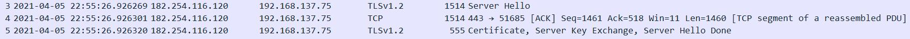

# 基于栈结构模拟Wireshark对tls组包和读取证书

## 代码逻辑

### 1.整体介绍

整体思路比较简单，就是对pcap文件中的报文逐个判断类型并解析。

所使用的结构体均为自定义结构体，除了读取证书时使用了openssl的命令行。

主要的两个模块分别针对http报文和tls加密报文；原定的私有协议模块，由于暂时无法解析上层报文模式而舍弃。

### 2.各模块思路和结果

模块实现中，最主要的特点是**tls中的证书分片(segments of PDU)重组的实现**。

各个模块在识别出报文类型后，会将相应字段信息结果打印出来(以ios端的刺激战场流量为例)：

**在进入模块之前，要先找出http报文和tls报文，可以根据tcp flag标志位筛选**

```
if(tcp_flags==0x18||tcp_flags==0x10)
```

#### http结果:

##### 

#### http思路：

##### 对于除content-type以外的字段：

#### tls结果:

**(1). client hello,字段为cipher suites&SNI:**


**(2). server hello (certificate+server hello done)，字段为证书内容(只展示部分)：**

```
pkt5:tls_handshake
server hello done
Certificate:
    Data:
        Version: 3 (0x2)
        Serial Number:
            02:95:a3:51:2b:38:4d:ff:1d:41:23:28:c3:9e:e2:be
        Signature Algorithm: sha256WithRSAEncryption
        Issuer: C = US, O = DigiCert Inc, OU = www.digicert.com, CN = Secure Site CA G2
        Validity
            Not Before: Aug 28 00:00:00 2020 GMT
            Not After : Sep 28 12:00:00 2021 GMT
        Subject: C = CN, ST = Guangdong Province, L = Shenzhen, O = Shenzhen Tencent Computer Systems Company Limited, OU = R&D, CN = httpdns.qq.com
```

#### tls思路：

##### 对于cipher suites和sni:

根据相应字段找出client hello，并定位到加密套件字段，循环找出所有套件。

定位到拓展字段位置。由于extensions**不提供个数，只有总长度，而各个extension长度不一，所以只能根据最后一个extension来定位。**最后一个extension的类型必然是0x21(padding)，所以如果在0x21之前都没找到0x00(server name)，说明该报文没有sni拓展字段。否则就打印出sni。

##### 对于证书：

证书包含在tls握手的第二个阶段，这个阶段服务器会向用户发送多个tls头部，包括Server hello，Certificate，Server Key Exchange和Server Hello Done。当MTU较大时，各个tls可以包含在一个分片中，例如LineTV的流量：


而在刺激战场流量中，MTU被限制在1500，所以当第二阶段的数据较大时，会利用同一个ack号分到不同的报文中：



那么就需要考虑如何定位这些报文。除了Certificate以外，另外三个部分的tls头部由于远小于MTU,内容一般不会被分割，并且分别位于头部和尾部，所以较容易定位，但certificate的tls头部和证书内容处于总体负载的中间位置，因此无法直接定位，于是就无法知道长度，也无法直接知道certificate被分成了几个“TCP Segment of PDU”。

例如刺激战场流量中的另一个例子，第二阶段的报文被分为了4个而不止3个：


此外，也会有报文之间夹杂其他会话的情况 ( 报文9495属于其他会话 ) ：


以及分片乱序的情况：


所以我的处理思路是：

一旦识别到server hello包，用它的四元组和ack号做标识，在找到相应的server hello done之前，所有满足标识的报文都是证书分片(实际情况是，还会将server key exchange和server hello done包含进去，但是并不影响)。**将这些报文的{负载偏移位置，负载长度，seq号}存入标识字典**，这样不论是夹杂会话还是乱序都能解决。当然，这里的偏移位置必须依赖于文件流，**如果对每个报文都使用指针的话，得到的只是临时分配的内存空间，在后续重组时会失效**。

找到server hello done之后，先利用seq排序，然后将各个负载存入一段连续内存，就可以还原证书。

## Requirements

WpdPack>=4.1.2,  OpenSSL>=1.1.1

